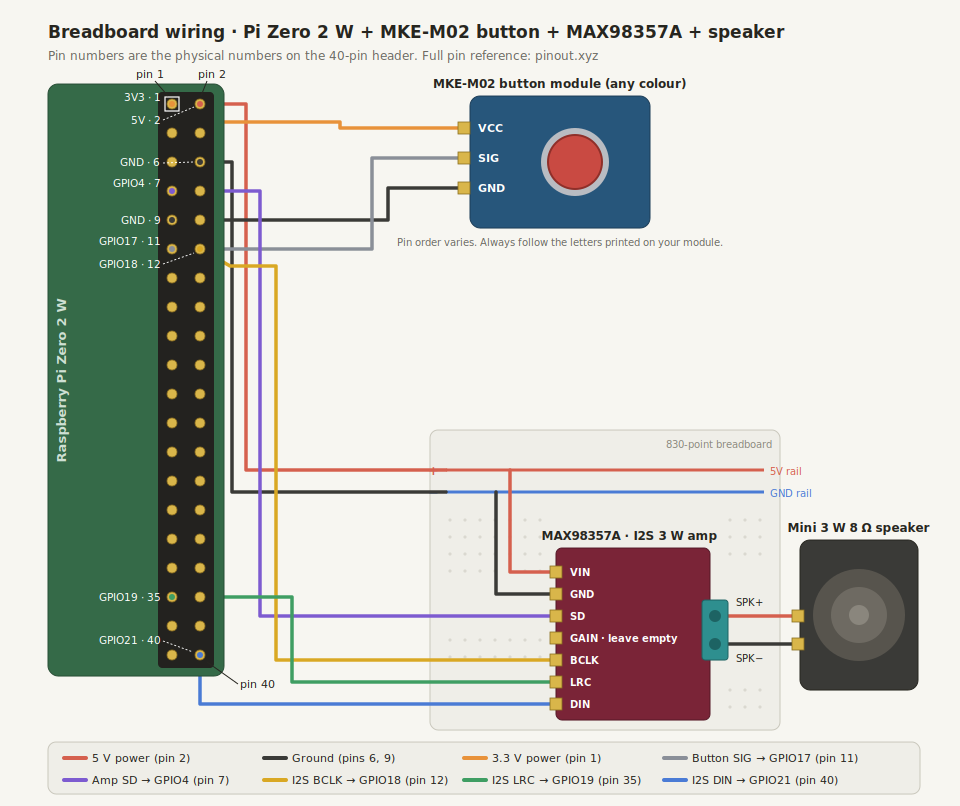

# Breadboard Starter Wiring: One Button + Sound

This guide walks you through wiring a minimal T-Cube prototype on a breadboard: one button you can press, and a speaker that plays sound. It is written for people who have never touched a Raspberry Pi or any electronics before. No soldering is needed if your Pi already has its 40-pin header attached.

When you are done, you will have the bench hardware needed for one-button audio validation. The release bundle installs the real GPIO runtime (`tcube-pi.service`), which treats GPIO17 as button 1 out of the box, so a button press plays audio right after install and reboot.

For the full five-button build and the complete parts inventory, see [Hardware Assembly](hardware-assembly.md). For installing the software, see [Raspberry Pi OS Lite Install](pi-os-lite-install.md).

## What You Need


| Part                                                          | What it does                                                                                 |
| ------------------------------------------------------------- | -------------------------------------------------------------------------------------------- |
| Raspberry Pi Zero 2 W (with 40-pin header)                    | The small computer that runs T-Cube.                                                         |
| MakerEdu MKE-M02 button module (any colour)                   | A push button on a small circuit board, ready to plug in.                                    |
| MAX98357A I2S amplifier breakout                              | Turns the Pi's digital audio into power for a speaker.                                       |
| Mini 3 W 8-ohm speaker with enclosure                         | Plays the sound.                                                                             |
| 830-point solderless breadboard                               | A plastic board with holes that lets you connect parts without soldering.                    |
| Male-to-female jumper wires                                   | Flexible wires: the male end plugs into the breadboard, the female end slides onto a Pi pin. |
| Small flathead screwdriver                                    | For the amplifier's green screw terminal.                                                    |
| 5 V / 2.5 A Micro-USB power supply and a flashed microSD card | To power and boot the Pi (see the OS install guide).                                         |


## Three Rules Before You Touch Anything

1. **Never wire with the power on.** Unplug the Pi completely before adding, moving, or removing any wire. Wiring a live board is the number one way beginners destroy hardware.
2. **Pi pins are 3.3 V only.** The GPIO pins can be damaged by 5 V. That is why the button module gets its power from the 3.3 V pin, never from the 5 V pin.
3. **Count pins, do not guess.** The 40 pins are numbered 1 to 40. Pin 1 has a square solder pad on the back of the board. Odd numbers (1, 3, 5...) are one row, even numbers (2, 4, 6...) are the other. When in doubt, check the interactive map at [pinout.xyz](https://pinout.xyz/).


## How a Breadboard Works (30 Seconds)

- The two long lines along the edge are **power rails**. Every hole in one rail line is connected together. We will use one rail for 5 V (marked +, usually a red line) and one for ground (marked -, usually a blue line).
- In the middle area, each **half-row of 5 holes** is connected together. Pushing the amplifier's pins into a row lets you reach each amp pin from the neighbouring holes.
- "GND" (ground) is the common return path for electricity. Everything in a circuit must share a ground.


## The Wiring Diagram



Wire colours in the diagram are only a convention to keep things readable. Any colour wire works electrically, but sticking to red for power and black for ground will save you from mistakes.

## Wire It, Step by Step

Work with the Pi unplugged the whole time.

### Step 1: Find pin 1

Hold the Pi with the 40-pin header on the right. Pin 1 is the corner pin closest to the microSD card slot, marked with a square pad underneath. Confirm with the photo map on [pinout.xyz](https://pinout.xyz/). All pin numbers below are these physical numbers, not GPIO numbers.

### Step 2: Power rails


| From Pi pin                                                     | To                | Suggested colour |
| --------------------------------------------------------------- | ----------------- | ---------------- |
| Pin 2 (5 V) ([pinout](https://pinout.xyz/pinout/pin2_5v_power)) | Breadboard + rail | Red              |
| Pin 6 (GND) ([pinout](https://pinout.xyz/pinout/ground))        | Breadboard - rail | Black            |


### Step 3: Amplifier

Push the MAX98357A into the breadboard so each pin gets its own row. Then connect:


| Amp pin | To                                                                   | Suggested colour |
| ------- | -------------------------------------------------------------------- | ---------------- |
| VIN     | Breadboard + rail (5 V)                                              | Red              |
| GND     | Breadboard - rail                                                    | Black            |
| SD      | Pi pin 7, GPIO4 ([pinout](https://pinout.xyz/pinout/pin7_gpio4))     | Purple           |
| GAIN    | Nothing. Leave it empty for the default volume.                      |                  |
| BCLK    | Pi pin 12, GPIO18 ([pinout](https://pinout.xyz/pinout/pin12_gpio18)) | Yellow           |
| LRC     | Pi pin 35, GPIO19 ([pinout](https://pinout.xyz/pinout/pin35_gpio19)) | Green            |
| DIN     | Pi pin 40, GPIO21 ([pinout](https://pinout.xyz/pinout/pin40_gpio21)) | Blue             |


BCLK, LRC, and DIN are the three wires of **I2S**, the Pi's digital audio output. SD lets the software mute and unmute the amp.

### Step 4: Speaker

Strip 5 to 6 mm of insulation from the speaker wires, insert them into the amp's green screw terminal, and gently tighten the screws: red wire into **SPK+**, black wire into **SPK-**. Tug lightly to confirm they are clamped.

The speaker connects **only** to the amp terminal. Never wire a speaker directly to the Pi.

### Step 5: Button module

The MKE-M02 plugs in with three jumper wires. Read the letters printed next to its connector and match them exactly:


| Button pin | To                                                                   | Suggested colour |
| ---------- | -------------------------------------------------------------------- | ---------------- |
| VCC        | Pi pin 1, 3.3 V ([pinout](https://pinout.xyz/pinout/pin1_3v3_power)) | Orange           |
| GND        | Pi pin 9, GND ([pinout](https://pinout.xyz/pinout/ground))           | Black            |
| SIG        | Pi pin 11, GPIO17 ([pinout](https://pinout.xyz/pinout/pin11_gpio17)) | Grey             |


The module has its pull resistor built in, so no extra parts are needed. This starter wire uses BCM GPIO17, physical pin 11. In the full five-button assembly, GPIO17 is the red button wire; see [Hardware Assembly](hardware-assembly.md).

## Double-Check Before Powering On

- [ ] VIN goes to the 5 V rail and the rail comes from pin 2. Reversed power kills the amp.
- [ ] The button's VCC goes to pin 1 (3.3 V), **not** to 5 V.
- [ ] No bare wire ends are touching each other.
- [ ] The speaker wires are firmly clamped in the screw terminal.
- [ ] Count the header pins one more time. Off-by-one is the most common wiring bug.


## Power On and Test

1. Follow [Raspberry Pi OS Lite Install](pi-os-lite-install.md) to flash the card and enable I2S audio. The key part is adding these lines to `/boot/config.txt` and rebooting:
  ```ini
  dtoverlay=max98357a
  dtparam=i2s=on 
  ```
2. Check that the sound card exists:
  ```sh
   aplay -l
  ```
   You should see a card whose name includes `sndrpimaxims`. If not, power down and re-check the BCLK, LRC, DIN, VIN, and GND wires.
3. Play a test sound (start with low expectations, it is a small speaker):
  ```sh
   speaker-test -D plughw:CARD=MAX98357A,DEV=0 -t wav -c 2 -l 1
  ```
4. Test the button. Press and hold it while running:
  ```sh
   pinctrl get 17    # newer Pi OS; use "raspi-gpio get 17" on older images
  ```
   The reported level should change between pressed and released.
5. Install the release bundle following [Raspberry Pi OS Lite Install](pi-os-lite-install.md). The installer enables `tcube-pi.service`, whose default button map already assigns GPIO17 to button 1. After the post-install reboot, pressing the button plays audio through the speaker; watch it live with `journalctl -u tcube-pi -f`.


## Tips and Common Mistakes

- **Nothing works at all:** make sure you power the Pi through the Micro-USB port labelled **PWR**. The other Micro-USB port is for data.
- **No sound but the card shows up:** the most common cause is BCLK and LRC swapped. Power down and swap them back.
- **Quiet hiss or crackle:** normal at idle for this amp is near silence; a loud hiss usually means a loose GND. A 100 uF capacitor across the + and - rails near the amp also helps.
- **Pops when rebooting:** harmless with this amp, but never plug or unplug the speaker while audio is playing.
- **Button never triggers:** confirm SIG is really on physical pin 11, and that VCC and GND are not swapped on the module.
- **Jumper wires fall out:** breadboard contacts wear out. Move to a fresh row, or use shorter, stiffer jumpers.
- Keep wires short and flat. A tidy board is easier to debug than a bird's nest.
- Take a photo of your working wiring before you change anything. Future you will be grateful.
